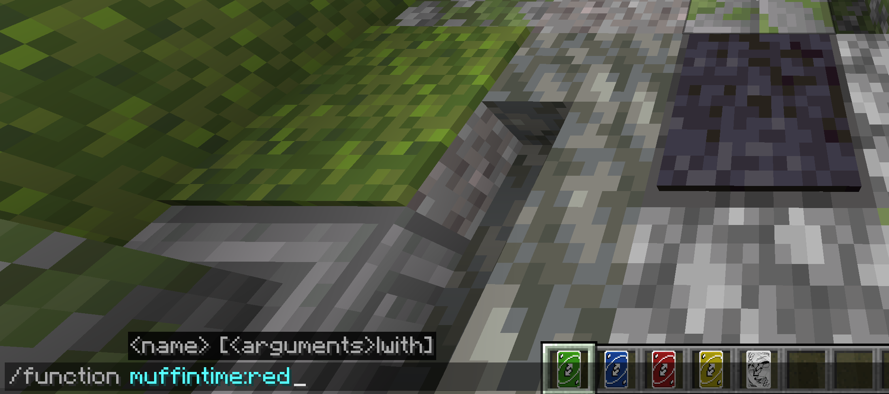
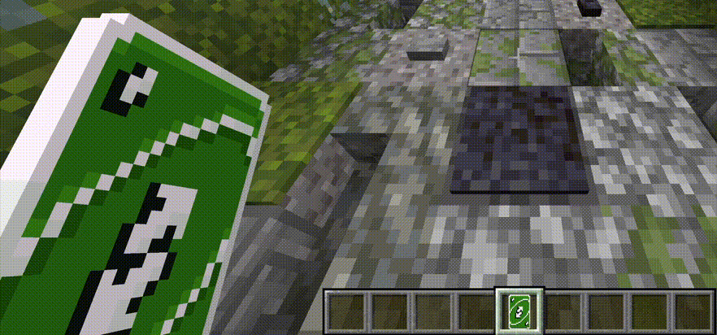

# The MuffinTime Datapack

This datapack is used to change resources of totems while using [muffintime-resource-pack](https://github.com/RealMuffinTime/muffintime-resource-pack).

  
  

## Features

It's is possible to change Totem textures via the command `/function muffintime:<totem_type>`.  
Currently `<totem_type>` can be one of:

| Custom item texture for totem    | custom_model_data | `<totem_type>`    |
| -------------------------------- | ----------------- | ----------------- |
| UNO Reverse Card Green           | green             | green             |
| UNO Reverse Card Blue            | blue              | blue              |
| UNO Reverse Card Red             | red               | red               |
| UNO Reverse Card Yellow          | yellow            | yellow            |
| Animated UNO Reverse Card Ahegao | ahegao            | ahegao            |
| Cosmic UNO Reverse Card          | cosmic            | cosmic            |

Changed data is applied to every totem in your inventory. 

It is recommended to install a permission system, because the `/function` command is by default only available to server operators.

## Credits

* Created by RealMuffinTime